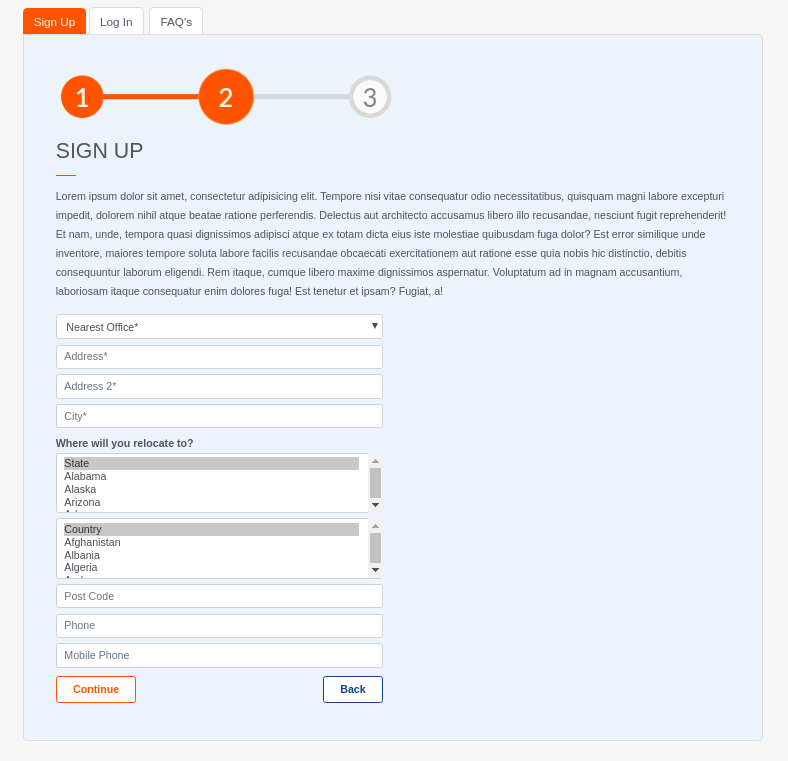

# Object

A JavaScript object has properties associated with it. A property of an object can be explained as a variable that is attached to the object. Object properties are basically the same as ordinary JavaScript variables, except for the attachment to objects. The properties of an object define the characteristics of the object. You access the properties of an object with a simple dot-notation:

#### Assignment

* Create a form through JS DOM

* This form has 3 stages    
    1. create account via email page 
    

    2. Personal information page 
    

    3. Career page  
    


**Note:**
When the user fills out the form, store the detail in a variable by creating the appropriate dataset - ``` use only advanced JS concepts: Object, Array, Event, Dom, conditional statements, let, const, function and etc```

* print in console

* Such as a user submit the form. Generate a dynamic resume in the web page, that the user has filled out the details in the form.